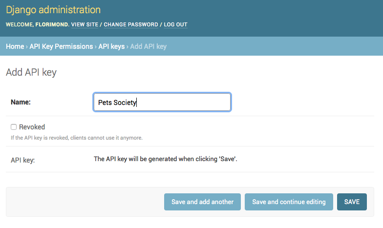
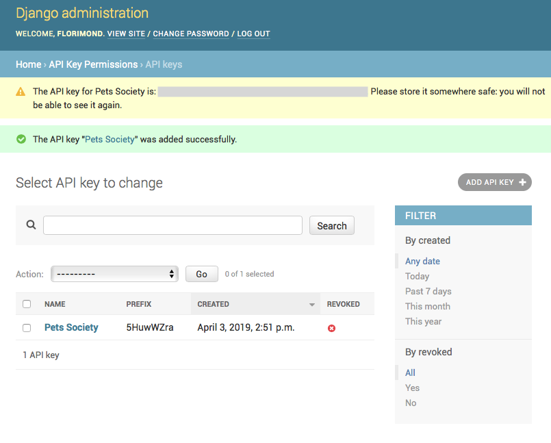
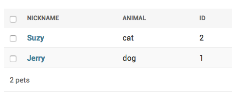

# djangorestframework-api-key-example

Example project showcasing the usage of [djangorestframework-api-key](../).

This is a pets management app. The API is protected using the `HasAPIKey` permission class.

## Install

- Clone the repo and install dependencies (preferrably in a virtualenv!):

```bash
$ pip install -r requirements.txt
```

- Then run migrations (creates an SQLite database):

```bash
$ python manage.py migrate
```

- Create a superuser to access the admin site:

```bash
$ python manage.py createsuperuser
# Enter user information as instructed
```

- Finally, start the server:

```bash
$ python manage.py runserver
```

## Usage

- Go to the admin site at http://localhost:8000/admin and create an API key:




- The generated secret key is shown to you:



- Save it to an environment variable, along with the API key name:

```bash
export API_KEY_NAME=pets-friends-community
export API_KEY_SECRET_KEY=...  # replace with your own secret key
```

- Now, create a few pets:



- Finally, perform some requests to the API! We're using [requests](http://docs.python-requests.org) here:

```python
import os
import requests

url = 'http://localhost:8000/pets/'
resp = requests.get(url)
assert resp.status_code == 403

name = os.getenv("API_KEY_NAME")
secret_key = os.getenv("API_KEY_SECRET_KEY")
auth = "Api-Key: {}:{}".format(name, secret_key)

resp = requests.get(url, headers={"Authorization": auth})
assert resp.status_code == 200

print(resp.json())
```

Here's the result:

```json
[
  { "id": 1, "name": "Dog", "noise": "Woof!" },
  { "id": 2, "name": "Cat", "noise": "Meow!" }
]
```

🎉
