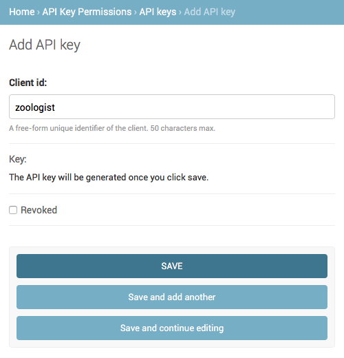
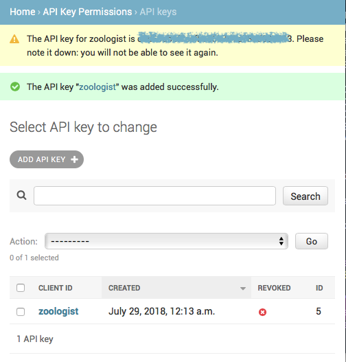

# djangorestframework-api-key-example

Example project showcasing the usage of [djangorestframework-api-key](https://github.com/florimondmanca/djangorestframework-api-key).

This is a simple app for managing animals in a zoo. The API is protected using the `HasAPIKey` permission class.

## Install

Clone the repo and install dependencies (preferrably in a virtualenv!):

```
$ pip install -r requirements.txt
```

Then run migrations (creates a SQLite database):

```
$ ./manage.py migrate
```

Create a superuser to access the admin site:

```
$ ./manage.py createsuperuser
# Enter user information as instructed
```

And start the server:

```
$ ./manage.py runserver
```

## Usage

Go to the admin site at http://localhost:8000/admin and:

- Create an API key:





- Create a few animals:


Then try performing requests to the API:

```bash
$ curl http://localhost:8000/animals
{"detail":"Authentication credentials were not provided."}

$ curl -H 'Api-Token: YOUR_API_TOKEN' -H 'Api-Secret-Key: YOUR_API_SECRET_KEY' http://localhost:8000/animals
[{"id":1,"name":"Dog","noise":"Woof!"},{"id":2,"name":"Cat","noise":"Meow!"}]
```

Or with [requests](http://docs.python-requests.org) (`pip install requests`):

```python
>>> import requests
>>> url = 'http://localhost:8000/animals'
>>> resp = requests.get(url)
>>> resp.status_code
403
>>> resp = requests.get(url, headers={
...     'Api-Token': 'YOUR_API_TOKEN',
...     'Api-Secret-Key': 'YOUR_API_SECRET_KEY',
... })
>>> resp.status_code
200
>>> resp.json()
[{'id': 1, 'name': 'Dog', 'noise': 'Woof!'}, {'id': 2, 'name': 'Cat', 'noise': 'Meow!'}]
```

## See also

The package itself (djangorestframework-api-key):

- [GitHub](https://github.com/florimondmanca/djangorestframework-api-key)
- [PyPI](https://pypi.org/project/djangorestframework-api-key/)
